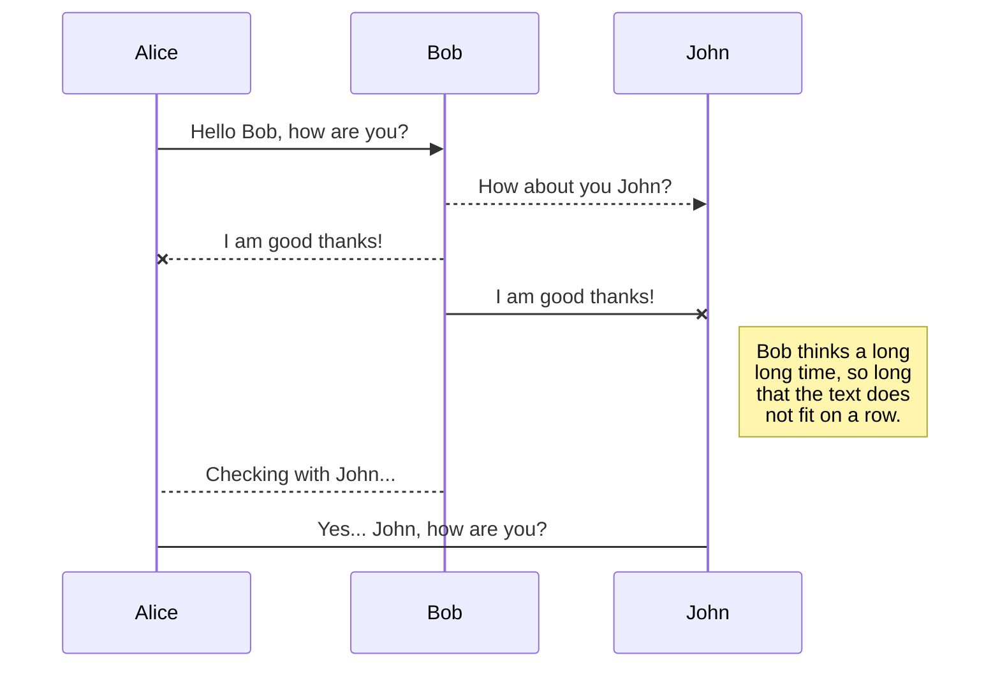
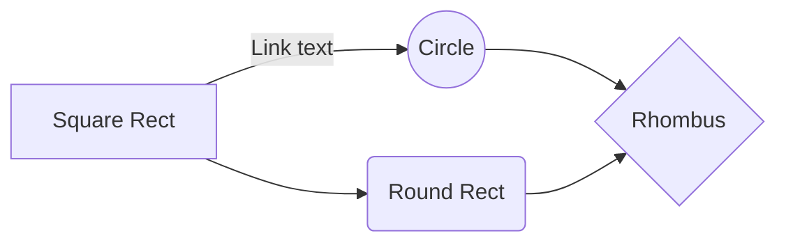
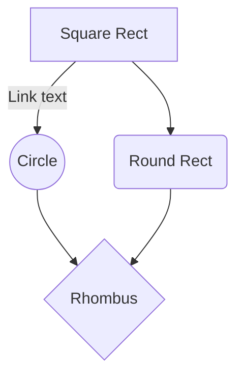
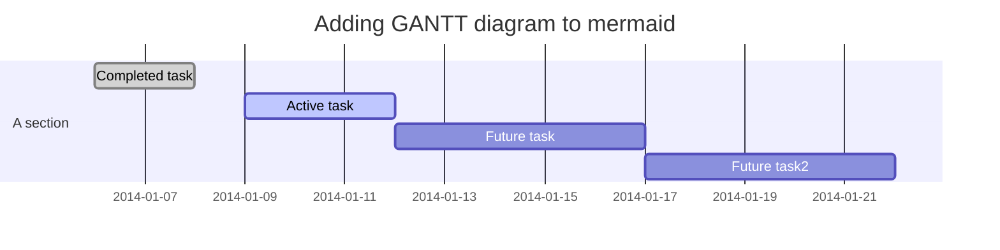
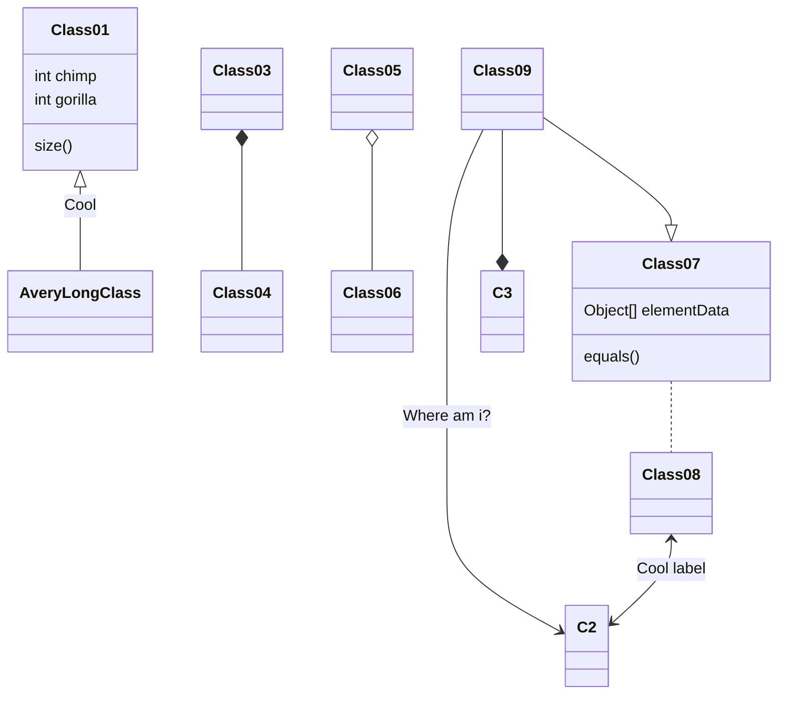

[Mermaid][mermaid_link]라는 mark down만으로 Diagram을 그리는데 좋은 프로젝트가 있길래 적용해보았습니다.
처음에는 Jekyll에서 plugin으로 [jekyll-mermaid][jekyll_mermaid_link]가 있어서 플러그인을 적용했습니다.
하지만 Github에서는 플러그인을 추가하는 것으로는 적용하기 어려워 스크립트를 추가하는 방법으로 적용하게 되었습니다.
Jekyll과 gem을 안 써봐서 조금 난해했는데 그래도 적용하는 데 성공했습니다.

## Mermaid 설정
jekyll의 mermaid를 적용하는 방법은 더 많을 수도 있겠지만 제가 찾은 방법은 2가지가 있습니다.
그 방법은 아래와 같습니다.
* plugin을 설치해서 적용하는 방법
* script를 추가하는 방법

### 적용 순서
#### plugin을 설치하는 방법
1. [Mermaid][mermaid_link]를 설치하고 build합니다.
    ```bash
    git clone https://github.com/knsv/mermaid

    cd mermaid
    yarn install
    yarn build
    ```

2. Mermaid의 dist에 생성된 js파일을 jekyll 프로젝트로 옮깁니다.
    - 정리를 위해 js 폴더를 만들어 넣어둡니다.

3. jekyll의 `_config.yml`파일에 jekyll-mermaid 플러그인을 추가합니다.

   ```gem
    plugins:
      - 기존의 plugin
      - jekyll-mermaid

    # Plugin For Diagram
    mermaid:
      src: '<url>/<path>/mermaid.js'
   ```

4. `GemFile`파일에 dependency를 추가합니다.

    ```gem
    group :jekyll_plugins do
      gem '기존의 plugin'
      gem 'jekyll-mermaid', '~> 1.0'
    end
    ```

5. gem으로 jekyll-mermaid를 install합니다.
    ```bash
    gem install jekyll-mermaid
    ```

#### Script를 추가하는 방법
1. 아래의 코드를 mermaid를 사용할 layout의 head에 추가합니다.
```html
  <script src="{{ "/js/mermaid.js" }}"></script>
```

2. 아래의 코드를 mermaid를 사용할 layout의 html에 추가합니다.
    * theme의 값으로는 default, forest, dark, neutral가 있습니다.

```html
  <script>
    var config = {
      startOnLoad:true,
      theme: 'neutral',
      flowchart:{
        useMaxWidth:false,
        htmlLabels:true
      }
    };
    mermaid.initialize(config);
    window.mermaid.init(undefined, document.querySelectorAll('.language-mermaid'));
  </script>
```

> Github page로 사용할 경우 plugin 추가가 불가능하기 때문에 Script 추가를 사용합니다*
>
> 만일 mermaid의 색상을 조정하고 싶다면 `mermaid.js`의 색상 값을 수정하여 적용할 수 있습니다.

---

### 적용 결과

#### Sequence Diagram
> 순서대로 진행되는 과정을 보여주기 좋습니다.

``` markdown
sequenceDiagram
Alice ->> Bob: Hello Bob, how are you?
Bob-->>John: How about you John?
Bob--x Alice: I am good thanks!
Bob-x John: I am good thanks!
Note right of John: Bob thinks a long<br/>long time, so long<br/>that the text does<br/>not fit on a row.

Bob-->Alice: Checking with John...
Alice->John: Yes... John, how are you?
```



--------------------------------

#### Graph LR, Graph TD Diagram
> Flow Chart 용도
> TD는 세로, LR은 가로

```markdown
graph LR
A[Square Rect] -- Link text --> B((Circle))
A --> C(Round Rect)
B --> D{Rhombus}
C --> D
```



```markdown
graph TD
A[Square Rect] -- Link text --> B((Circle))
A --> C(Round Rect)
B --> D{Rhombus}
C --> D
```



--------------------------------

#### Gantt Diagram
> Task 진행 순서를 보여주는 용도

```markdown
gantt
dateFormat  YYYY-MM-DD
title Adding GANTT diagram to mermaid

section A section
Completed task            :done,    des1, 2014-01-06,2014-01-08
Active task               :active,  des2, 2014-01-09, 3d
Future task               :         des3, after des2, 5d
Future task2               :         des4, after des3, 5d
```



--------------------------------

#### Class Diagram
> Class 다이어그램

```markdown
classDiagram
Class01 <|-- AveryLongClass : Cool
Class03 *-- Class04
Class05 o-- Class06
Class07 .. Class08
Class09 --> C2 : Where am i?
Class09 --* C3
Class09 --|> Class07
Class07 : equals()
Class07 : Object[] elementData
Class01 : size()
Class01 : int chimp
Class01 : int gorilla
Class08 <--> C2: Cool label
```



--------------------------------

#### Git Graph Diagram
> git 순서를 보여주는 용도

```markdown
gitGraph:
options
{
    "nodeSpacing": 150,
    "nodeRadius": 10
}
end
commit
branch newbranch
checkout newbranch
commit
commit
checkout master
commit
commit
merge newbranch
```


이 모든 기능들을 다 사용할지는 모르겠지만 괜찮은 플러그인으로 보입니다.


[mermaid_link]: https://github.com/knsv/mermaid
[jekyll_mermaid_link]: https://rubygems.org/gems/jekyll-mermaid/versions/1.0.0
