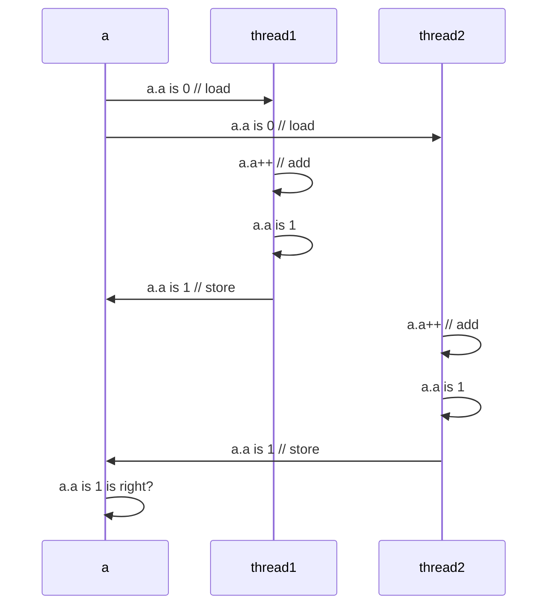

프로그래밍을 하다보면 속도가 중요해지는 경우가 있습니다. 시간이 오래 걸리는 작업을 할 때에는 하나의 thread만이 아닌
여러 thread에 작업을 분할하여 동시에 여러 작업을 병렬처리 프로그래밍을 고려할 수 있습니다. 물론
속도 문제에만 병렬처리가 사용되는 것은 아니고 작업이 백그라운드로 이루어져야 할 때에도 thread 작업이 고려됩니다.
자바에서는 이를 위해 `multi thread programming`을 지원합니다. 간단하게 Thread 객체를 만들고 실행할 기능을
지정하여 thread 작업을 실행할 수 있습니다.

### Java의 Thread programming

```java
Thread thread = new Thread(new Runnable() {
    @Override
    public void run() {
    // 실행할 작업
    }
});

또는

Thread thread = new Thread(() -> {
// 실행할 작업
});

또는

class ThreadA extends Thread {
    @Override
    public void run() {
    // 실행할 작업
    }
}
이후 new ThreadA() 사용
```

위와 같은 방법들을 통해 자바에서는 thread 작업을 간단하게 할 수 있습니다.
첫 번째 방법은 한번 실행하고 같은 작업을 다른 thread에 시킬 일이 없을 때에 주로 사용하는 방법으로
굳이 재활용할 일이 없는 코드를 `class`를 만들 필요가 없으므로 new Runnable() 의 run함수만
채워 간단하게 thread를 만들어 내는 방법입니다.

물론 최근에는 Runnable 객체조차 코드가 너무 길어져 람다식을 이용해 더 간단하게 thread를 만드는
두번째 방법을 많이 사용하는 듯 합니다. 물론 람다식이 자바 8버전에서 나왔기 때문에 이전버전의 자바를
이용한다면 이 방법은 사용할 수 없습니다.

세번째 방법으로 같은 기능을 하는 thread가 다른 곳에서도 또 만들어 질 수 있어
`Thread`를 상속받은 클래스를 정의해두고 이후 클래스 객체를 만들어 재사용할 수 있게 만드는 방법이 있습니다.
위처럼 thread를 정의한 이후 `thread.start()`함수를 호출하게 되면 thread 작업이 실행됩니다.

위의 thread를 만드는 방법은 재사용 가능성, 자바 버전 등의 상황에 맞게 사용하면 됩니다.

### Java Thread programming 주의점
thread 프로그래밍을 할 때에 주의할 점이 여러가지 있겠지만 thread의 오버헤드 문제와 동기화문제를 생각해야 합니다.


###### thread가 7개 이상부터는 큰 차이가 없다. (Main Thread포함 8개)

thread를 만들 때에는 기본적으로 thread를 생성하는 오버헤드 시간이 걸립니다. 실행할 작업이 thread를 만들어내서
동시에 작업을 처리할 때의 시간은 단순 두배의 속도가 되는 것이 아닙니다. 기본적으로 thread의 개수는 core개수보다
많아질 경우 성능이 증가하지 않고 thread에 시키는 일이 너무 작을 경우는 thread를 만드는 시간 때문에
오히려 성능이 저하될 수도 있습니다. 이런 thread의 생성, 종료의 비용 문제를 해결하기 위해 thread pool을 미리
만들어 두고 관리하기도 하는데 이는 다음 포스팅에서 다루겠습니다.

하지만 이미지 작업을 여러 가지를 해야 하는 시간이 오래 걸리는 경우에는 성능 향상효과를 얻을 수 있고
GUI같이 사용자의 입력을 항상 받아야 하고 작업을 동시에 진행해야 하는 단순 성능보다는 사용자 반응 시간이
더 중요한 경우는 `Thread programming`이 필요합니다.

또 다른 주의할 점이 있는데 바로 동기화 문제입니다.

#### 동기화 문제

```java
class A {
  int a;
}

public class Main {

    public static void main(String[] args) throws InterruptedException {
        A a = new A();
        Thread t1 = new Thread(() -> {
            for (int i = 0; i < 1000; ++i)
                a.a++;
        });
        t1.start();

        Thread t2 = new Thread(() -> {
            for (int i = 0; i < 1000; ++i)
                a.a++;
        });
        t2.start();

        t1.join();
        t2.join();  // 두 thread가 종료될 때까지 기다림

        혹은

        while (t1.isAlive() || t2.isAlive()) {
        // 두 thread가 종료될 때까지 busy wait으로 기다림
        }

        System.out.println(a.a);
    }
}
```

이 코드에서 출력되는 a.a는 무슨 값이 될까요? 2000이 되기를 기대하지만 운이 좋게 2000이 될 수도 있고
2000에 모자란 값이 출력될 수도 있습니다. 위의 코드에서 t1, t2 thread가 동시에 같은 변수를 접근하고 있는데
이 때 두 thread에서 실행된 `a.a++;`은 `a+=2;`의 효과를 내야 하지만 동시에 두 코드가 실행될 경우
서로의 실행 결과를 무시하여 제대로된 결과를 얻지 못하게 됩니다. 이 때 동시에 같은 변수를 접근하는 코드 부분을
critical section, 임계영역 이라고 부릅니다.



위와 같은 흐름으로 thread1의 연산 결과가 thread2의 연산결과로 인해 무시되어버리는 경우
계산 결과가 다르게 나올 수 있게 됩니다. 이렇게 변수에 동시 접근하는 경우 동기화 문제가 일어날 수 있는데
이를 해결하기 위한 방법은 크게 3가지가 있습니다.

1. Semaphore, mutex
2. synchronized (monitor)
3. Atomic


#### Semaphore, Mutex

Semaphore 방법은 고전적으로 C에서 멀티 프로세스 혹은 멀티 스레드의 동기화문제를 해결하기 위해
사용되던 방법입니다. semaphore, mutex는 멀티 프로세스, 멀티 스레드 상황 모두를 해결할 수 있습니다.
세마포어는 count를 두어 임계영역에 접근하는 스레드의 개수를 제한하는 방식입니다. 제한된 자원 안에서
임계 영역에 접근하게 될 경우 사용하게 됩니다.

예를 들어 counting semaphore는 JDBC의 connection 수를 제한하려 할 때, 네트워크 연결을 제한하려 할 때 등
일정 사람 수만이 자원을 사용하게 할 경우 사용할 수 있습니다. mutex는 세마포어가 count가 1인 상태와 크게 다르지 않습니다.
실제 세마포어를 보면 binary 상태로 lock, unlock 할 일이 많아 mutex가 많이 사용됩니다.

```java
import java.util.concurrent.Semaphore;

public class Main {

    public static void main(String[] args) throws InterruptedException {
        A a = new A();
        Semaphore semaphore = new Semaphore(1);
        Thread t1 = new Thread(() -> {
            for (int i = 0; i < 1000; ++i) {
                semaphore.acquire(); // lock을 어디서 거느냐에 따라 실행 방법과 performance가 다르다.
                a.a++;
                semaphore.release(); // 현재 lock을 자주 걸기 때문에 성능이 떨어질 수 있다.
            }
        });
        t1.start();

        Thread t2 = new Thread(() -> {
            for (int i = 0; i < 1000; ++i)
                semaphore.acquire();
                a.a++;
                semaphore.release();
        });
        t2.start();

        t1.join();
        t2.join();  // 두 thread가 종료될 때까지 기다림

        혹은

        while (t1.isAlive() || t2.isAlive()) {
        // 두 thread가 종료될 때까지 busy wait으로 기다림
        }

        System.out.println(a.a);
    }
}
```

위와 같이 Semaphore를 통해 임계영역에 들어올 수 있는 thread를 제한할 수 있습니다. 세마포어의 단점으로는
변수로 락을 지정하고 있어 lock을 거는 위치가 정해져있지 않아 어디에서 lock이 걸릴지 알기 어렵습니다.
이때 서로 lock이 걸려 무한히 기다리는 Deadlock이 발생한다면 Deadlock이 걸리는 위치를 쉽게 디버깅하기 어렵습니다.
또한 코드 작성 중 실수로 lock의 해제를 해주지 않았다면 다른 코드에서 무한히 기다리는 Thread를 확인할 수도 있습니다.

이러한 점을 막기 위해서 C++에서는 `std::lock_guard`를 이용하여 lock이 scope에 따라 자동으로 닫힐 수 있게끔
만들 수 있습니다. C++은 Java와 다르게 객체가 Stack 영역에 잡힐 수 있고 Stack 영역에 잡힌 객체는
scope가 끝날 때에 소멸자가 호출되므로 이 점을 이용해 자동으로 scope가 끝날 때 lock을 해제하도록 만들 수 있습니다.

하지만 Java는 Garbage Collector를 이용하여 메모리를 관리하기 때문에 언제 객체가 회수될 지 모르고
객체가 Stack 영역에 생성될 수도 없습니다. 때문에 자바의 finalize를 통해 c++의 소멸자처럼
scope 단위로 Lock을 처리하는 것이 어렵습니다.

#### synchronized (Monitor)

하지만 Java에서도 scope 단위로 락을 처리하는 방법이 있습니다. synchronized 키워드를 이용하여 scope의
시작 부분에서 객체의 mutex에 lock을 걸고 scope가 끝날 때에 unlock을 걸게 됩니다. synchronized는
monitor라는 방식으로 동기화를 시키게 되는데 어떻게 synchronized라는 키워드 하나로 모든 객체들의
동기화를 시킬 수 있을까요?

Java의 모든 객체는 기본적으로 Object라는 클래스를 상속받게 됩니다. Object 클래스에는 여러 객체의 기본적인 함수들이 있지만
`wait()`, `notify()`, `notifyAll()`와 같은 함수들이 있습니다. 이 함수들의 주석을 보다보면 monitor라는
말이 나옵니다.


###### notify, wait, notifyAll 함수는 native함수다.

native 함수로 구성되어 있는데 이 함수들이 바로 monitor의 구성요소입니다. monitor는 객체마다 조건 변수를 두어
조건변수를 변경하며 lock을 거는 방식으로 구현되어 있습니다. 객체마다 mutex가 있는 셈입니다.
그 조건변수의 값을 바꾸는 것이 위의 함수들입니다. 덕분에 자바의 개발자들은 mutex, semaphore와 같은
lock을 거는 방법을 모르더라도 쉽게 동기화 방법을 사용할 수 있습니다.

또한, monitor는 mutex와 semaphore와는 달리 언어에서 지원해주는 lock 방식입니다. 그렇기 때문에 mutex,
semaphore와는 조금 차이가 있습니다. semaphore, mutex는 프로세스가 다르더라도 서로 같은 semaphore를
이용함으로서 서로 동기화할 수 있습니다. 하지만 monitor는 메모리에 올라가는 객체에만 들어있기 때문에 다른 프로세스에서 접근할 수 없습니다.
만약 DB, 파일처럼 다른 프로세스에서 동시에 접근 가능한 부분은 semaphore와 mutex같은 방법을 이용해야 합니다.

monitor는 프로세스의 스레드 간 동기화를 위해, mutex, semaphore는 멀티 프로세스 또한 동기화하는데 사용할 수 있다는
차이가 있습니다. monitor는 단일 프로세스를 타겟으로 하여 좀더 가볍고 빠르다는 장점이 있으므로
용도를 잘 구분하여 사용하는 것이 좋을 듯 합니다. 이런 lock을 사용하는 방법보다 더 속도가 빠른
동기화 방법이 있습니다.

#### Atomic

위의 두 방법은 lock을 이용하여 동기화하는 방법이었습니다. 하지만 Atomic은 조금 다릅니다.
자바에서는 AtomicInteger, AtomicLong, AtomicIntegerArray 등 Atomic이 붙은
객체가 있습니다. 이 경우는 원자성을 가진다고 하여 이름에 Atomic이 붙은 것인데 lock이 없는
원자성이라는 점에서 위의 두 방법과는 차이가 있습니다.

```java
a = a + 1;
// load
// add
// store
```

lock이 없으면 race condition에 의해서 연산이 제대로 이루어지지 않을텐데 어떻게 구현되었나 궁금합니다.
위의 단순 + 연산도 코드로는 한 줄이지만 `assembly`코드로 변환하면 `load`, `add`, `store`의
연산으로 나뉘게 됩니다. 그렇기 때문에 race condition이 발생하게 되면 load 이후 store하기 전 cpu가
넘어간다면 연산 순서가 변할 수 있습니다.

그런 문제가 있었기 때문에 위의 두 방법과 같이 lock을 사용했었지만 Atomic 변수는 CAS(Compare And Swap)이라는
방법을 사용합니다.

```c
int compare_and_swap(int* register, int old_val, int new_val) {
    int old_register_value = *(register);
    if (old_register_value == old_val)
        *(register) = new_val;
    return old_register_value;
}
```

CAS를 C 언어로 보이면 위와 같은 코드와 같은 작업을 합니다. 위의 코드를 직접 실행한다면 전혀 atomic하지
않겠지만 하드웨어적으로 위의 연산과 같은 작업을 하는 instruction을 지원하고 있어 atomic한 연산이 가능해집니다.
만약 값을 확인할 때에 달라졌을 경우 값을 변화시키지 않고 다음 클럭에 다시 instruction을 재실행합니다.
그렇게 하여 다른 스레드에서 값이 변경되었을 때에 연산을 지연시켜 충돌이 일어나지 않게 만듭니다.
연산 지연으로 인해 기존 실행보다는 속도가 느려지긴 하지만 lock을 거는 연산보다는 더 빠른 속도로 연산할 수 있습니다.

#### 정리하며

Java에서 동기화를 위해 lock을 거는 방법, atomic 변수를 이용하는 방법을 정리했지만 사실
동기화를 위한 방법들은 모두 기존 연산에 비하면 시간이 오래 걸리게됩니다. 그렇기 때문에 lock을 걸었을 때
deadlock 여부만 판단하는 것이 아닌 lock이 불필요하게 걸리지 않았는지 판단하는 것 또한 중요합니다.
동기화는 반드시 필요하지만 적절한 상황에 맞게 잘 사용할 수 있도록 주의해야 합니다.
